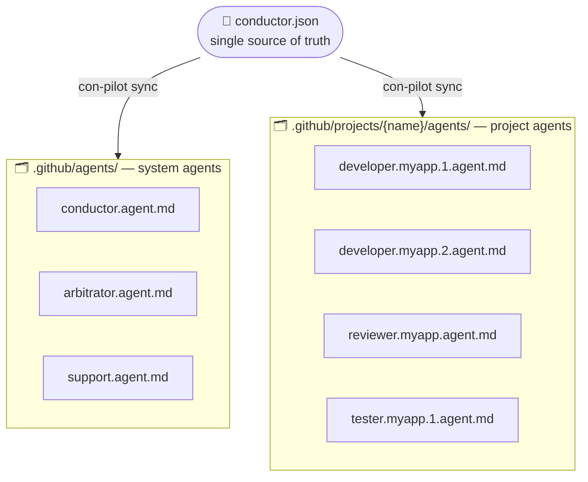
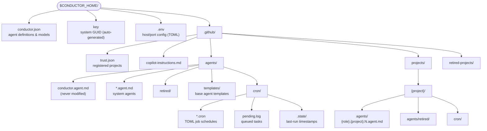
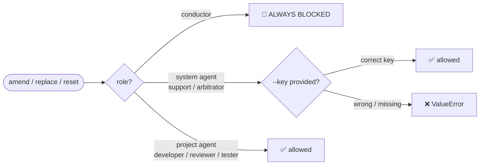
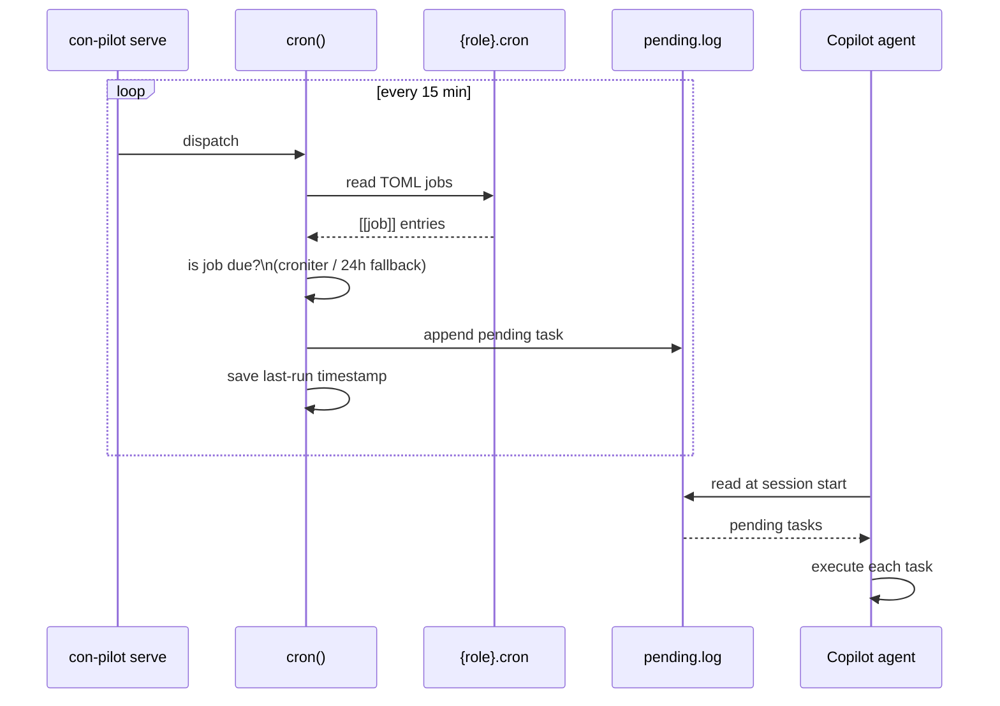

# con-pilot

> **The synchronisation engine for the Conductor AI agent system.**

`con-pilot` keeps your VS Code Copilot agent roster in sync with a single source of truth (`conductor.json`), dispatches scheduled tasks, and exposes every lifecycle operation as a simple CLI command.

---

## Table of Contents

- [con-pilot](#con-pilot)
  - [Table of Contents](#table-of-contents)
  - [Overview](#overview)
  - [How it works](#how-it-works)
  - [Directory layout](#directory-layout)
  - [conductor.json reference](#conductorjson-reference)
  - [trust.json](#trustjson)
  - [Agent naming templates](#agent-naming-templates)
  - [CLI commands](#cli-commands)
    - [sync](#sync)
    - [cron](#cron)
    - [serve](#serve)
    - [setup-env](#setup-env)
    - [register](#register)
    - [retire-project](#retire-project)
    - [amend](#amend)
    - [replace](#replace)
    - [reset](#reset)
  - [Agent editing \& security](#agent-editing--security)
  - [Cron jobs](#cron-jobs)
  - [Templates](#templates)
  - [Environment variables](#environment-variables)
  - [Running the tests](#running-the-tests)

---

## Overview

The **Conductor** system is a multi-agent framework built on top of VS Code Copilot. Each AI agent is defined as a `.agent.md` file under `.github/` — Copilot picks these up automatically and makes the named agent available in chat.



`con-pilot` is the CLI/service that:
- **Reconciles** `.agent.md` files with `conductor.json` — creating, retiring, and restoring them automatically
- **Dispatches** cron jobs defined per-agent in TOML cron files
- **Manages** project registration and trust boundaries
- **Provides** a FastAPI service for continuous background sync
- **Protects** system agents behind a GUID key to prevent accidental modification

---

## How it works


---

## Directory layout



---

## conductor.json reference

```jsonc
{
  "models": {
    "default_model": "claude-opus-4.6",
    "authorized_models": ["gpt-4o", "claude-opus-4.6", ...]
  },
  "agent": {
    // ── System agent (lives in .github/agents/) ────────────────────────────
    "arbitrator": {
      "name": "sir",                       // VS Code agent name
      "description": "Resolves conflicts …",
      "active": true,
      "model": "claude-opus-4.6",
      "scope": "system",                   // "system" | "project"
      "has_cron_jobs": true                // enables cron file creation
    },

    // ── Project agent with numbered instances ──────────────────────────────
    "developer": {
      "name": "code-monkey-[scope:project]-agent-[rank]",
      "description": "Writes production code …",
      "active": true,
      "sidekick": true,                    // exported as SIDEKICK_AGENT_NAME
      "model": "claude-opus-4.6",
      "scope": "project",
      "instances": { "min": 1, "max": 2 } // creates developer.{proj}.1 & .2
    },

    // ── Single-instance project agent ──────────────────────────────────────
    "reviewer": {
      "name": "nosy-parker-[scope:project]",
      "description": "Reviews PRs …",
      "active": true,
      "model": "claude-opus-4.6",
      "scope": "project"
    }
  }
}
```

| Field | Type | Description |
|-------|------|-------------|
| `name` | string | VS Code agent display name. Supports [placeholders](#agent-naming-templates). |
| `description` | string | Shown as the agent's "Use when:" hint in Copilot. |
| `active` | bool | When `false` the agent is retired and its file moved to `retired/`. |
| `scope` | `"system"` \| `"project"` | System agents go to `.github/agents/`; project agents to `.github/projects/{name}/agents/`. |
| `model` | string | LLM model identifier. |
| `sidekick` | bool | Exactly one agent should be marked `true`; exported as `SIDEKICK_AGENT_NAME`. |
| `has_cron_jobs` | bool | Creates a TOML cron file for this agent during sync. |
| `instances.max` | int | Creates `N` numbered agent files (e.g. `developer.proj.1.agent.md` … `.N.agent.md`). |

---

## trust.json

`.github/trust.json` maps project names to their root directories. Only paths listed here are considered trusted — agents are instructed not to operate outside `TRUSTED_DIRECTORIES`.

```json
{
  "conductor": "/home/user/.conductor",
  "my-app":    "/home/user/projects/my-app",
  "api":       "/home/user/projects/api"
}
```

The `conductor` entry is always enforced and cannot be removed.

---

## Agent naming templates

Agent `name` fields support placeholder tokens that are substituted at file-creation time:

| Placeholder | Substituted with |
|-------------|------------------|
| `[scope:project]` | The current project name (e.g. `my-app`) |
| `[rank]` | The instance number for multi-instance agents (e.g. `1`, `2`) |
| Any unknown `[token]` | Removed; consecutive `-` are collapsed |

**Examples:**

```
"code-monkey-[scope:project]-agent-[rank]"
  → project=my-app, rank=2  →  "code-monkey-my-app-agent-2"

"nosy-parker-[scope:project]"
  → project=api              →  "nosy-parker-api"

"sir"
  → (system, no project)     →  "sir"
```

---

## CLI commands

All commands share the same invocation prefix:

```
con-pilot <command> [options]
```

---

### sync

Reconcile `.agent.md` files against `conductor.json`, then dispatch due cron jobs.

```
con-pilot sync
```


- Files for **active** roles that are missing → **created** (from template if available, or generated from config)
- Files for **active** roles that previously existed in `retired/` → **restored**
- Files for roles that are no longer active or no longer in `conductor.json` → **moved to `retired/`**
- `conductor.agent.md` is **never modified**

---

### cron

Dispatch cron jobs only — check all agents with `has_cron_jobs: true` and queue any due tasks to `pending.log`.

```
con-pilot cron
```

---

### serve

Start the con-pilot FastAPI service. Runs a background sync loop and exposes REST endpoints.

```
con-pilot serve [-i SECONDS]
```

| Option | Default | Description |
|--------|---------|-------------|
| `-i`, `--interval` | `900` | Seconds between sync cycles. |

**Endpoints:**

| Method | Path | Description |
|--------|------|-------------|
| `GET` | `/health` | Returns `{"status": "ok"}` |
| `POST` | `/sync` | Trigger a manual sync cycle |
| `POST` | `/cron` | Trigger a manual cron dispatch |

---

### setup-env

Resolve project context, print all session environment variables, and start the background watcher.

```
con-pilot setup-env [--shell]
```

```bash
# Plain output (KEY=VALUE):
con-pilot setup-env

# Shell-evaluable output (export KEY="VALUE"):
eval $(con-pilot setup-env --shell)
```

**Example output:**
```
CONDUCTOR_HOME=/home/user/.conductor
TRUSTED_DIRECTORIES=/home/user/.conductor:/home/user/projects/my-app
COPILOT_DEFAULT_MODEL=claude-opus-4.6
CONDUCTOR_AGENT_NAME=uppity
SIDEKICK_AGENT_NAME=code-monkey-my-app-agent-1
PROJECT_NAME=my-app
SYNC_AGENTS_PID=48291
```

Project name resolution order:


---

### register

Register a new project: add it to `trust.json`, create its directory scaffold, and run an initial sync.

```
con-pilot register <name> <directory>
```

```bash
con-pilot register my-app /home/user/projects/my-app
```

```
✔  Registered 'my-app' at /home/user/projects/my-app
✔  Created .github/projects/my-app/agents/
✔  Created .github/projects/my-app/cron/
✔  Created developer.my-app.1.agent.md
✔  Created developer.my-app.2.agent.md
✔  Created reviewer.my-app.agent.md
✔  Created tester.my-app.1.agent.md
✔  Created tester.my-app.2.agent.md
✔  Created agile.my-app.agent.md
✔  Created git.my-app.agent.md
```

After registration, the project appears in `trust.json` and all its agents are live in Copilot.

---

### retire-project

Archive a project: move its directory to `.github/retired-projects/` and remove it from `trust.json`.

```
con-pilot retire-project <name>
```

```bash
con-pilot retire-project my-app
```

```
✔  Moved .github/projects/my-app → .github/retired-projects/my-app
✔  Removed 'my-app' from trust.json
```

If the destination already exists (e.g. a previous retirement), a timestamp suffix is appended:

```
.github/retired-projects/my-app.20260412153042
```

---

### amend

Append or replace the `## Instructions` section in matching agent file(s).  
All other sections (Role, Behavior, Sidekick, etc.) are preserved.

```
con-pilot amend <file> <role> [project] [--key KEY]
```

```bash
# Amend all developer instances in a project
con-pilot amend instructions.md developer my-app

# Amend a system agent (requires system key)
con-pilot amend instructions.md support --key $(cat $CONDUCTOR_HOME/key)
```

**`instructions.md`** (example):
```markdown
- Always write unit tests for every new function.
- Follow PEP 8 and project linting rules.
- Never commit directly to main.
```

**Before:**
```markdown
---
name: "code-monkey-my-app-agent-1"
model: "claude-opus-4.6"
---

## Role
Writes production code…

## Behavior
- Follow session setup…
```

**After:**
```markdown
---
name: "code-monkey-my-app-agent-1"
model: "claude-opus-4.6"
---

## Role
Writes production code…

## Behavior
- Follow session setup…

## Instructions
- Always write unit tests for every new function.
- Follow PEP 8 and project linting rules.
- Never commit directly to main.
```

Running `amend` a second time **replaces** the `## Instructions` block, not appends.  
Multi-instance agents (`developer.1`, `developer.2`, …) are **all amended simultaneously**.

---

### replace

Replace the entire body of matching agent file(s) while keeping the YAML frontmatter intact.

```
con-pilot replace <file> <role> [project] [--key KEY]
```

```bash
con-pilot replace new-body.md reviewer my-app
```

The frontmatter (`name:`, `model:`, `description:`, `tools:`) is preserved exactly.  
Everything after the closing `---` is replaced with the file contents.

---

### reset

Reset agent file(s) to their template-generated or config-generated defaults.  
Any custom `## Instructions` or other additions are discarded.

```
con-pilot reset <role> [project] [--key KEY]
```

```bash
# Reset all developer instances in a project
con-pilot reset developer my-app

# Reset a system agent (requires system key)
con-pilot reset support --key $(cat $CONDUCTOR_HOME/key)
```

Reset resolution order:
1. Template file at `.github/agents/templates/{role}.agent.md` (preserves body, swaps name/model)
2. Generated from `conductor.json` description + sidekick flag + behavior block

---

## Agent editing & security



The **system key** is a UUID stored at `$CONDUCTOR_HOME/key`. It is generated automatically the first time a system agent would be edited. To retrieve it:

```bash
cat $CONDUCTOR_HOME/key
# e.g. 3f2a1b4c-8d7e-4f5a-9c2b-1e3d5f7a9c0b
```

Commands that accept `--key`:

| Command | Project agent | System agent | Conductor |
|---------|:---:|:---:|:---:|
| `amend` | no key | `--key` required | blocked |
| `replace` | no key | `--key` required | blocked |
| `reset` | no key | `--key` required | blocked |

---

## Cron jobs

Agents with `"has_cron_jobs": true` get a TOML cron file created during sync:

```
$CONDUCTOR_HOME/.github/agents/cron/{role}.cron        ← system agents
$CONDUCTOR_HOME/.github/projects/{proj}/cron/{role}.cron ← project agents
```

**Format:**

```toml
[[job]]
name     = "daily-standup"
schedule = "0 9 * * *"          # standard cron expression
task     = "Summarise yesterday's commits and open PRs. Post to .github/output/sessions/."

[[job]]
name     = "sync-agents"
schedule = "*/15 * * * *"
task     = "Reconcile .github/agents/ with conductor.json."
```



When a job is due, `con-pilot cron` appends it to `pending.log`:

```
[2026-04-12T09:00:01+00:00] role=conductor agent=uppity job=daily-standup schedule='0 9 * * *'
  task: Summarise yesterday's commits and open PRs…
```

Copilot reads `pending.log` at session start and invokes the appropriate agent for each entry.

---

## Templates

Place a file at `.github/agents/templates/{role}.agent.md` to customise the base content for that role.  
`con-pilot` will use it as the starting point when creating or resetting agent files, substituting:

- `name: "PLACEHOLDER"` → actual expanded name
- `model: "PLACEHOLDER"` → default model from `conductor.json`
- `You are **PLACEHOLDER**,` → actual name in the intro line

Everything else (tools, custom sections, style) is preserved verbatim.

Example: `.github/agents/templates/developer.agent.md` is used as the base for all `developer.{proj}.N.agent.md` files.

---

## Environment variables

| Variable | Set by | Description |
|----------|--------|-------------|
| `CONDUCTOR_HOME` | `setup-env` | Absolute path to the conductor home directory. |
| `TRUSTED_DIRECTORIES` | `setup-env` | Colon-separated list of trusted project directories from `trust.json`. |
| `COPILOT_DEFAULT_MODEL` | `setup-env` | Default LLM model from `conductor.json`. |
| `CONDUCTOR_AGENT_NAME` | `setup-env` | Name of the conductor agent (e.g. `uppity`). |
| `SIDEKICK_AGENT_NAME` | `setup-env` | Name of the sidekick agent, with project/rank expanded (e.g. `code-monkey-my-app-agent-1`). |
| `PROJECT_NAME` | `setup-env`, `register` | Name of the current project. |
| `SYNC_AGENTS_PID` | `setup-env` | PID of the background `con-pilot serve` process. |

---

## Running the tests

```bash
cd $CONDUCTOR_HOME/python/con-pilot

# Run all tests
python3 -m pytest tests/ -v

# With coverage
python3 -m pytest tests/ -v --cov=con_pilot --cov-report=term-missing
```

The test suite uses isolated `tmp_path` fixtures — no real `$CONDUCTOR_HOME` files are touched. 56 tests cover every command and edge case.

```
tests/test_con_pilot.py::TestExpandName            5 tests  — name template substitution
tests/test_con_pilot.py::TestSplitFrontmatter      2 tests  — YAML frontmatter parsing
tests/test_con_pilot.py::TestEnv                   5 tests  — session environment vars
tests/test_con_pilot.py::TestSync                  8 tests  — agent reconciliation
tests/test_con_pilot.py::TestCron                  3 tests  — cron dispatch
tests/test_con_pilot.py::TestRegister              4 tests  — project registration
tests/test_con_pilot.py::TestRetireProject         4 tests  — project retirement
tests/test_con_pilot.py::TestAmendAgent            6 tests  — amend command + security
tests/test_con_pilot.py::TestReplaceAgent          3 tests  — replace command + security
tests/test_con_pilot.py::TestResetAgent            5 tests  — reset command + security
tests/test_con_pilot.py::TestCli                  11 tests  — CLI dispatch for all commands
```
