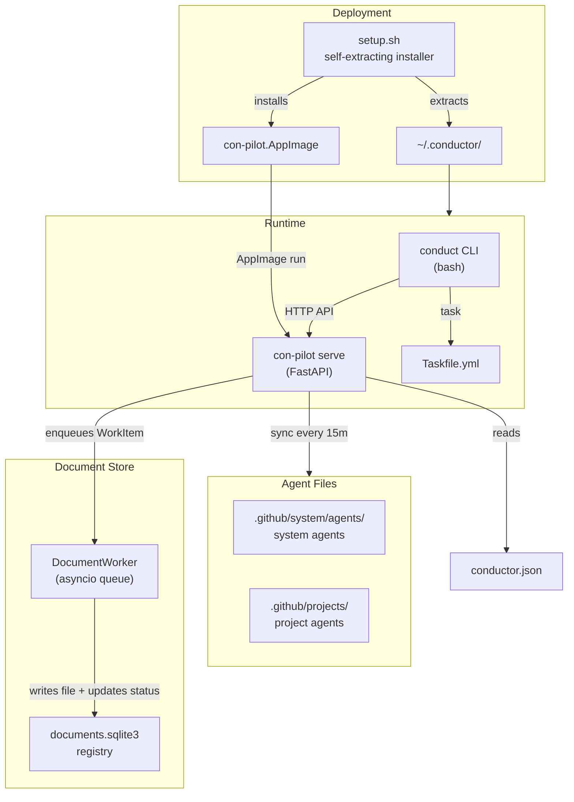
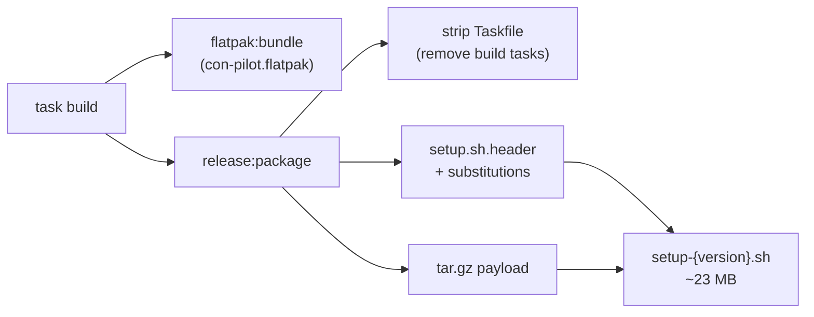
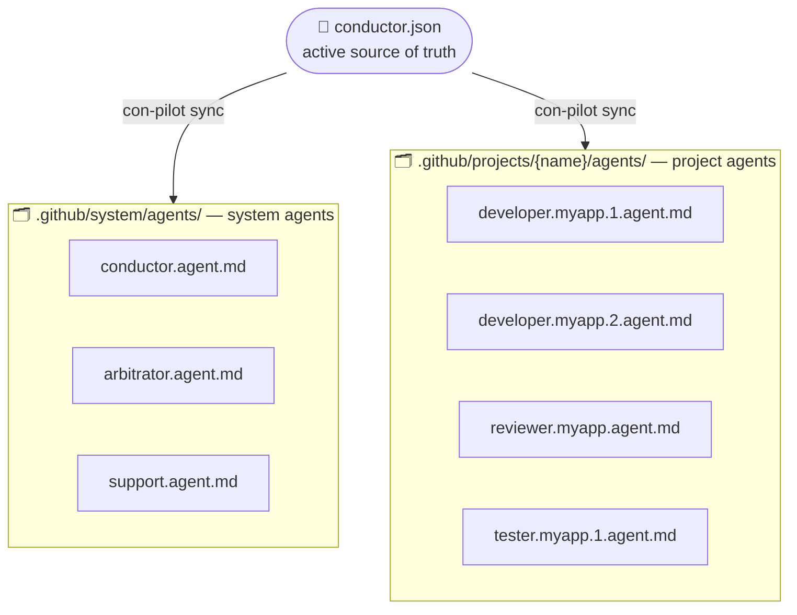
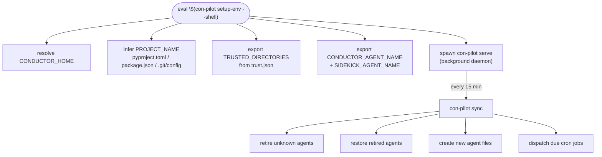
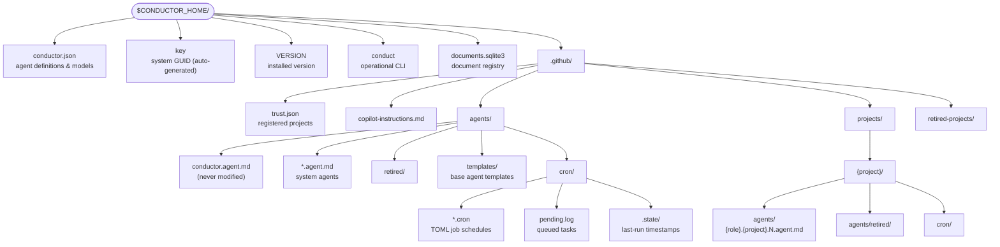
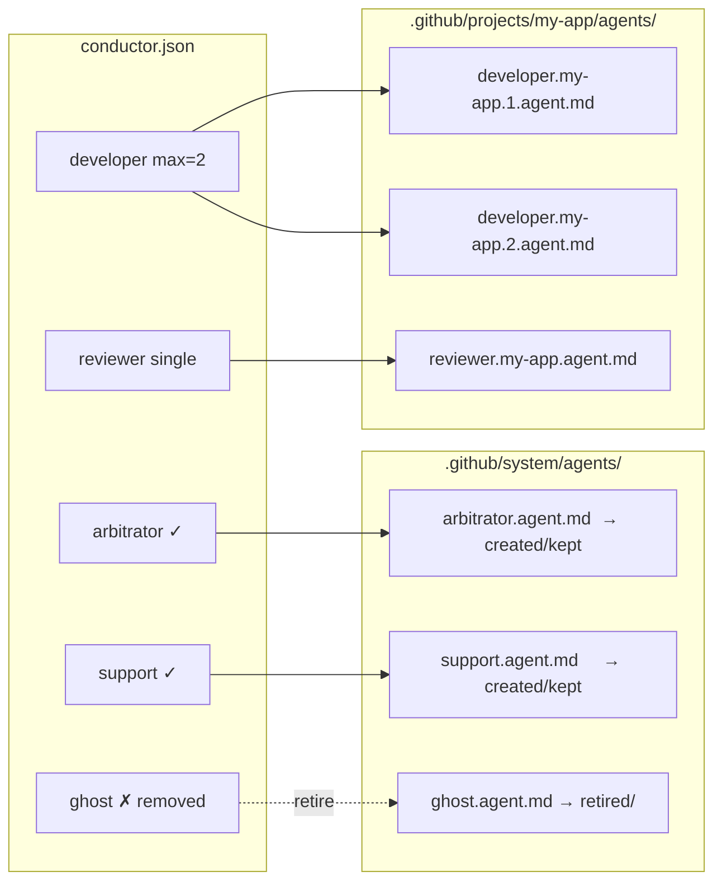
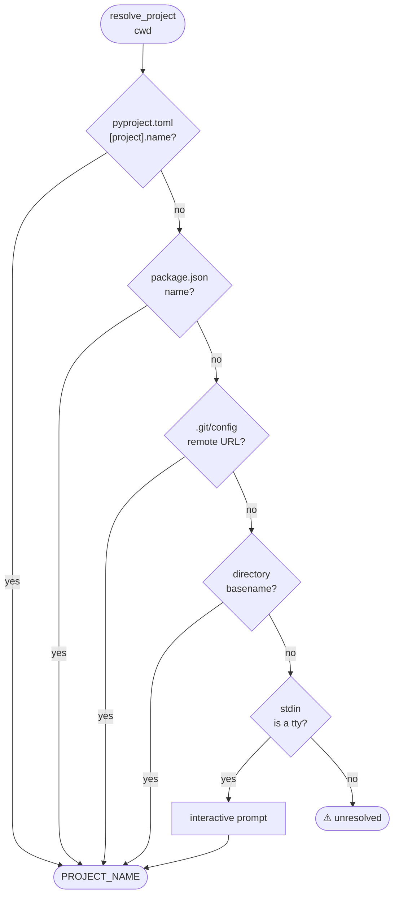
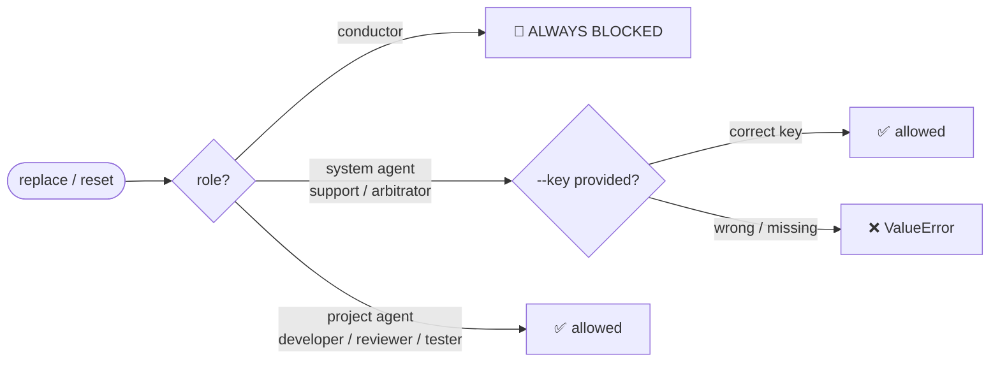
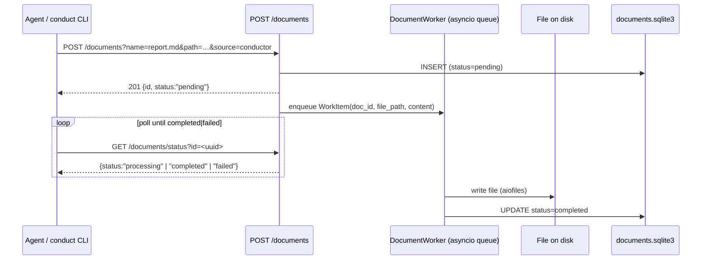
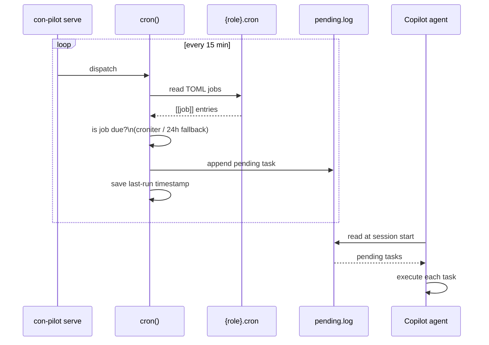

# Conductor

> **A multi-agent orchestration framework for [GitHub Copilot](https://github.com/features/copilot).**

Conductor manages a fleet of AI agents defined from a single configuration source. Current installs use `conductor.json` by default, while the loader still accepts YAML inputs for compatibility. It automatically creates, retires, and restores `.agent.md` files, dispatches scheduled cron tasks, and exposes lifecycle operations through both a CLI (`conduct`) and an HTTP API (`con-pilot`).

---

## Table of Contents

- [Conductor](#conductor)
  - [Table of Contents](#table-of-contents)
  - [Features](#features)
  - [Quick start](#quick-start)
  - [Architecture](#architecture)
  - [Installation](#installation)
  - [Building from source](#building-from-source)
  - [The `conduct` CLI](#the-conduct-cli)
  - [The `setup.sh` installer](#the-setupsh-installer)
  - [Overview](#overview)
  - [How it works](#how-it-works)
  - [Directory layout](#directory-layout)
  - [Configuration reference](#configuration-reference)
  - [trust.json](#trustjson)
  - [Agent naming templates](#agent-naming-templates)
  - [CLI commands](#cli-commands)
    - [sync](#sync)
    - [cron](#cron)
    - [serve](#serve)
    - [setup-env](#setup-env)
    - [register](#register)
    - [retire-project](#retire-project)
    - [amend (disabled)](#amend-disabled)
    - [replace](#replace)
    - [reset](#reset)
  - [Agent editing \& security](#agent-editing--security)
  - [Cron jobs](#cron-jobs)
  - [Document store](#document-store)
  - [The `conduct` CLI — documents command](#the-conduct-cli--documents-command)
  - [Templates](#templates)
  - [Environment variables](#environment-variables)
  - [Running the tests](#running-the-tests)

---

## Features

- **Single source of truth** — all agents defined in one active configuration file (`conductor.json` by default)
- **Automatic sync** — creates, retires, and restores `.agent.md` files every 15 minutes
- **AppImage packaging** — con-pilot ships as a self-contained AppImage with Python and uv-based bootstrap
- **Self-extracting installer** — `setup.sh` bundles everything into a single ~23 MB file
- **Install / Update / Uninstall** — full lifecycle via `setup.sh install`, `setup.sh update`, `setup.sh uninstall`
- **Admin key security** — system agents protected by a UUID key; conductor agent permanently locked
- **Cron scheduling** — TOML-based per-agent cron jobs dispatched automatically
- **Project isolation** — trust boundaries enforced via `trust.json`; agents scoped per-project
- **Versioned config** — `ConfigStore` tracks named configuration snapshots in `.scores/` with diff and rollback
- **Document store** — async queue-backed document API; agents `POST` files and poll status until `completed`; SQLite registry at `documents.sqlite3`
- **HTTP API** — FastAPI service mounted under `/api/v1` with health, auth, agent, project, config, snapshot, cron, tasks, documents, sync, and startup-proof endpoints
- **`conduct` CLI** — user-facing operational CLI wrapping the HTTP API, including a full `documents` subcommand
- **Pytest coverage** — unit + CLI integration tests isolated with `tmp_path` fixtures

---

## Quick start

```bash
# 1. Install from the self-extracting setup.sh
./releases/v0.5.0/setup-0.5.0.sh install ~/.conductor

# 2. Source the environment
source ~/.bashrc

# 3. Register a project
conduct register my-app /home/user/projects/my-app

# 4. Check status
conduct status
```

---

## Architecture



---

## Installation

### From setup.sh (recommended)

The self-extracting installer bundles the Flatpak, Taskfile, agent templates, and all configuration:

```bash
# Install
./setup-0.4.0.sh install ~/.conductor

# Update (reads CONDUCTOR_HOME from env)
./setup-0.4.0.sh update

# Uninstall
./setup-0.4.0.sh uninstall
```

On install, the admin key is displayed once and then erased. Save it — it's required for modifying system agents. The key is **not retrievable via the API** (no endpoint returns it); if you lose it, you must reinstall to generate a new one.

### From source (development)

See the [Building from source](#building-from-source) section below for detailed instructions.

---

## Building from source

### Prerequisites

| Tool                                         | Version | Purpose                                     |
| -------------------------------------------- | ------- | ------------------------------------------- |
| [Task](https://taskfile.dev/)                | v3+     | Task runner — orchestrates all build steps |
| [Flatpak](https://flatpak.org/)              | 1.12+   | Sandboxed application runtime               |
| [flatpak-builder](https://docs.flatpak.org/) | 1.2+    | Builds Flatpak applications                 |
| [Python](https://python.org/)                | 3.11+   | Runtime for con-pilot                       |
| [uv](https://github.com/astral-sh/uv)        | 0.10+   | Fast Python package manager                 |

Install the Freedesktop runtime and SDK (required for Flatpak build):

```bash
flatpak --user remote-add --if-not-exists flathub https://flathub.org/repo/flathub.flatpakrepo
flatpak --user install flathub org.freedesktop.Platform//24.08
flatpak --user install flathub org.freedesktop.Sdk//24.08
```

### Setting up the development environment

```bash
# Clone the repository
git clone https://github.com/oliben67/copilot-conductor.git
cd copilot-conductor

# Create and activate the Python virtual environment
cd src/python/con-pilot
uv sync --all-groups
source .venv/bin/activate
cd ../../..

# Verify task is available
task --version
```

### Build tasks

| Task                                | Description                                                |
| ----------------------------------- | ---------------------------------------------------------- |
| `task build`                        | Run tests → build Flatpak → package into`setup.sh`       |
| `task test`                         | Run the full pytest suite                                  |
| `task flatpak`                      | Full Flatpak pipeline: deps → build → bundle             |
| `task flatpak:force`                | Clean all artifacts and rebuild from scratch               |
| `task flatpak:clean`                | Remove build artifacts (keeps deps cache)                  |
| `task flatpak:clean:all`            | Remove all artifacts including deps cache                  |
| `task build-all`                    | Build everything (supports`--force` and `--release` flags) |
| `task release:package`              | Package into self-extracting`setup.sh`                     |
| `task release:package:deps-bundled` | Package with offline dependencies                          |

### Quick build

```bash
# Standard build (runs tests first)
CONDUCTOR_HOME=$(pwd) task build

# The installer is created at dist/setup-{version}.sh
```

### Full build with options

```bash
# Force a clean rebuild
task build-all -- --force

# Bump version and create a release package
task build-all -- --release

# Force rebuild AND create release
task build-all -- --force --release
```

### Offline / air-gapped build

For environments without internet access, build a full standalone bundle:

```bash
# Download offline dependencies (Platform, Sdk, uv)
task flatpak:deps:offline

# Build the full bundle with offline deps included
task flatpak:bundle:full

# Package into a self-extracting installer (~500+ MB)
task release:package:deps-bundled
```

The full bundle includes:

- `org.freedesktop.Platform` runtime
- `org.freedesktop.Sdk` SDK
- `uv` binary for Python bootstrapping

### Build outputs

After a successful build:

```
dist/
├── setup-{version}.sh              # Self-extracting installer (~23 MB)
├── setup-{version}-full-bundle.sh  # Full offline installer (~500+ MB)
└── io.conductor.ConPilot.flatpak   # Standalone Flatpak bundle

src/python/con-pilot/
├── flatpak/deps/                   # Downloaded wheel dependencies
├── flatpak/build-dir/              # Flatpak build directory
└── flatpak/repo/                   # Local Flatpak repository
```

### Testing

```bash
# Run all tests with verbose output
task test -- -v

# Run a specific test file
task test -- tests/test_cli_integration.py -v

# Run tests with coverage
cd src/python/con-pilot
python -m pytest tests/ -v --cov=con_pilot --cov-report=term-missing
```

---

## The `conduct` CLI

`conduct` is the user-facing operational CLI. It wraps Taskfile tasks and the con-pilot HTTP API.

```
conduct — Conductor (exact version depends on the installed release)

Usage:
  conduct <command> [options]

Service commands:
  start                      Start the con-pilot service
  stop                       Stop the con-pilot service
  status                     Show whether con-pilot is running
  sync                       Trigger a one-shot sync cycle
  logs [-n N] [-f]           Show service logs (last 10 lines; -f to follow)
  cron <subcommand>          Manage scheduled cron jobs (see 'conduct cron --help')
  tasks <subcommand>         Manage tasks defined in conductor.yaml (see 'conduct tasks --help')
  documents <subcommand>     Manage agent-saved documents (see 'conduct documents --help')
  agents show --all [-f]     List all agents (-f JSON indent=2)
  agents show <name> [-f]    Show details for a single agent
  agents config show [name] [-j]
                             Show one/all agent configurations
  agents config modify <name> [fields] --key KEY [-j]
                             Modify one agent configuration

Project commands:
  register <name> <dir>      Register a new project
  retire <name>              Retire a project

Admin commands (require --key):
  admin replace <file> <role> [project] --key KEY   Replace agent body with file
  admin reset   <role> [project]        --key KEY   Reset agent(s) to defaults

General:
  version                    Show version information
  end-points <subcommand>    API endpoint discovery and checks
  verify <item> <value>      Verify an item value (currently: key)
  help                       Show this help message
```

---

## The `setup.sh` installer

The build process (`task build`) produces a self-extracting shell script that contains:

1. A bash header with `install`, `update`, `uninstall`, `version`, and `help` commands
2. A compressed tar archive (appended after `__ARCHIVE__` marker)

The archive includes the Taskfile (stripped of build tasks), Flatpak bundle, agent templates, the active Conductor configuration, cron files, and the `conduct` CLI. Dev-only files (tests, .venv, .flatpak-builder) are excluded.



---

## Overview

The **Conductor** system is a multi-agent framework built on top of GitHub Copilot. Each AI agent is defined as a `.agent.md` file under `.github/` — Copilot picks these up automatically and makes the named agent available in chat.



`con-pilot` is the CLI/service that:

- **Reconciles** `.agent.md` files with the active configuration (`conductor.json` by default) — creating, retiring, and restoring them automatically
- **Dispatches** cron jobs defined per-agent in TOML cron files
- **Manages** project registration and trust boundaries
- **Provides** a FastAPI service for continuous background sync
- **Protects** system agents behind a GUID key to prevent accidental modification

---

## How it works



---

## Directory layout



---

## Configuration reference

Current installs use `conductor.json` as the primary config file. The examples below remain YAML-shaped because the loader still accepts YAML and the structure is easier to read in documentation.

```yaml
version:
  number: "1.0.0"
  description: "Initial configuration"
  date: "2026-04-18T10:00:00+00:00"
  notes: "Optional migration notes"

models:
  default_model: claude-opus-4.6
  authorized_models:
    - gpt-4o
    - claude-opus-4.6
    - gemini-2
    # … additional model identifiers

agent:
  # ── System agent (lives in .github/system/agents/) ─────────────────────────
  arbitrator:
    name: sir                         # Copilot agent name
    description: Resolves conflicts …
    active: true
    model: claude-opus-4.6
    scope: system                     # "system" | "project"
    has_cron_jobs: true               # enables cron file creation

  # ── Project agent with numbered instances ──────────────────────────────────
  developer:
    name: "code-monkey-[scope]-agent-[rank]"
    description: Writes production code …
    active: true
    sidekick: true                    # exported as SIDEKICK_AGENT_NAME
    model: claude-opus-4.6
    scope: project
    instances:
      min: 1
      max: 2                          # creates developer.{proj}.1 & .2

  # ── Single-instance project agent ──────────────────────────────────────────
  reviewer:
    name: "nosy-parker-[scope]"
    description: Reviews PRs …
    active: true
    model: claude-opus-4.6
    scope: project
```

| `name` | string | Copilot agent display name. Supports [placeholders](#agent-naming-templates). |
| `description` | string | Shown as the agent's "Use when:" hint in Copilot. |
| `active` | bool | When `false` the agent is retired and its file moved to `retired/`. |
| `scope` | `"system"` \| `"project"` | System agents go to `.github/system/agents/`; project agents go to `.github/projects/{name}/agents/`. |
| `model` | string | LLM model identifier. |
| `sidekick` | bool | Exactly one agent should be marked `true`; exported as `SIDEKICK_AGENT_NAME`. |
| `has_cron_jobs` | bool | Creates a TOML cron file for this agent during sync. |
| `instances.max` | int | Creates `N` numbered agent files (e.g. `developer.proj.1.agent.md` … `.N.agent.md`). |

---

## trust.json

`.github/trust.json` maps project names to their root directories. Only paths listed here are considered trusted — agents are instructed not to operate outside `TRUSTED_DIRECTORIES`.

```json
{
  "conductor": "/home/user/.conductor",
  "my-app":    "/home/user/projects/my-app",
  "api":       "/home/user/projects/api"
}
```

The `conductor` entry is always enforced and cannot be removed.

---

## Agent naming templates

Agent `name` fields support placeholder tokens that are substituted at file-creation time:

| Placeholder          | Substituted with                                             |
| -------------------- | ------------------------------------------------------------ |
| `[scope]`    | The current project name (e.g.`my-app`)                      |
| `[rank]`             | The instance number for multi-instance agents (e.g.`1`, `2`) |
| Any unknown`[token]` | Removed; consecutive`-` are collapsed                        |

**Examples:**

```
"code-monkey-[scope]-agent-[rank]"
  → project=my-app, rank=2  →  "code-monkey-my-app-agent-2"

"nosy-parker-[scope]"
  → project=api              →  "nosy-parker-api"

"sir"
  → (system, no project)     →  "sir"
```

---

## CLI commands

All commands share the same invocation prefix:

```
con-pilot <command> [options]
```

---

### sync

Reconcile `.agent.md` files against the active configuration, then dispatch due cron jobs.

```
con-pilot sync
```



- Files for **active** roles that are missing → **created** (from template if available, or generated from config)
- Files for **active** roles that previously existed in `retired/` → **restored**
- Files for roles that are no longer active or no longer in the active config → **moved to `retired/`**
- `conductor.agent.md` is **never modified**

---

### cron

Dispatch cron jobs only — check all agents with `has_cron_jobs: true` and queue any due tasks to `pending.log`.

```
con-pilot cron
```

---

### serve

Start the con-pilot FastAPI service. Runs a background sync loop and exposes REST endpoints.

```
con-pilot serve [-i SECONDS]
```

| Option             | Default | Description                  |
| ------------------ | ------- | ---------------------------- |
| `-i`, `--interval` | `900`   | Seconds between sync cycles. |

All routes are mounted under `/api/v1` by default.

**Core endpoints:**

| Method    | Path                                    | Auth              | Description                                           |
| --------- | --------------------------------------- | ----------------- | ----------------------------------------------------- |
| `GET`     | `/api/v1/health`                        | —                 | Returns `{"status": "ok"}`                           |
| `GET`     | `/api/v1/version`                       | —                 | Returns service version information                   |
| `GET`     | `/api/v1/startup-proof`                 | —                 | Returns Copilot SDK startup/runtime evidence          |
| `POST`    | `/api/v1/sync`                          | —                 | Trigger a manual sync cycle                           |
| `POST`    | `/api/v1/cron`                          | —                 | Trigger a manual cron dispatch                        |
| `GET`     | `/api/v1/validate`                      | —                 | Validate the active config against the schema         |
| `POST`    | `/api/v1/validate`                      | —                 | Validate a supplied config payload                    |
| `GET`     | `/api/v1/tasks`                         | —                 | List all configured tasks                             |
| `GET`     | `/api/v1/tasks/{name}`                  | —                 | Get task detail                                       |
| `POST`    | `/api/v1/tasks`                         | `X-Admin-Key`     | Register a new task                                   |
| `PATCH`   | `/api/v1/tasks/{name}`                  | `X-Admin-Key`     | Update mutable task fields                            |
| `DELETE`  | `/api/v1/tasks/{name}`                  | `X-Admin-Key`     | Remove a task and unregister its scheduler job        |
| `POST`    | `/api/v1/tasks/{name}/run`              | `X-Admin-Key`     | Queue a task for immediate execution                  |
| `GET`     | `/api/v1/tasks/dispatcher/status`       | —                 | Show live dispatcher state                            |
| `POST`    | `/api/v1/tasks/dispatcher/drain`        | `X-Admin-Key`     | Force one drain pass of pending.log                   |
| `GET`     | `/api/v1/cron/jobs`                     | —                 | List all cron jobs                                    |
| `GET`     | `/api/v1/cron/jobs/{name}`              | —                 | Get cron job detail                                   |
| `POST`    | `/api/v1/cron/jobs`                     | `X-Admin-Key`     | Create a new cron job                                 |
| `PATCH`   | `/api/v1/cron/jobs/{name}`              | `X-Admin-Key`     | Update a cron job                                     |
| `DELETE`  | `/api/v1/cron/jobs/{name}`              | `X-Admin-Key`     | Remove a cron job                                     |
| `GET`     | `/api/v1/cron/logs`                     | —                 | Tail cron pending.log                                 |

**Document store endpoints** (all under `/api/v1/documents`):

| Method   | Path                        | Auth          | Description                                                      |
| -------- | --------------------------- | ------------- | ---------------------------------------------------------------- |
| `POST`   | `/api/v1/documents`         | —             | Register a document; enqueues async write; returns 201 + UUID    |
| `GET`    | `/api/v1/documents`         | —             | List all documents (newest first)                                |
| `GET`    | `/api/v1/documents/status`  | —             | Poll write status for `?id=<uuid>` (pending→processing→completed) |
| `GET`    | `/api/v1/documents/find`    | —             | Find documents by `?path=<dir>&pattern=<glob>`                   |
| `GET`    | `/api/v1/documents/endpoints` | —           | OpenAPI 3.1.0 self-descriptor for this group                     |
| `GET`    | `/api/v1/documents/{id}`    | —             | Get a single document record by UUID                             |
| `PATCH`  | `/api/v1/documents/{id}`    | —             | Update metadata and/or re-queue a new file write                 |
| `DELETE` | `/api/v1/documents/{id}`    | `X-Admin-Key` | Delete record; `?delete_file=true` also removes the file         |

Additional routes cover login, key verification (confirms a supplied key — the admin key itself is **never returned** by any endpoint), user creation, agents, project operations, config versions, and snapshots.

---

### setup-env

Resolve project context, print all session environment variables, and start the background watcher.

```
con-pilot setup-env [--shell]
```

```bash
# Plain output (KEY=VALUE):
con-pilot setup-env

# Shell-evaluable output (export KEY="VALUE"):
eval $(con-pilot setup-env --shell)
```

**Example output:**

```
CONDUCTOR_HOME=/home/user/.conductor
TRUSTED_DIRECTORIES=/home/user/.conductor:/home/user/projects/my-app
COPILOT_DEFAULT_MODEL=claude-opus-4.6
CONDUCTOR_AGENT_NAME=uppity
SIDEKICK_AGENT_NAME=code-monkey-my-app-agent-1
PROJECT_NAME=my-app
SYNC_AGENTS_PID=48291
```

Project name resolution order:



---

### register

Register a new project: add it to `trust.json`, create its directory scaffold, and run an initial sync.

```
con-pilot register <name> <directory>
```

```bash
con-pilot register my-app /home/user/projects/my-app
```

```
✔  Registered 'my-app' at /home/user/projects/my-app
✔  Created .github/projects/my-app/agents/
✔  Created .github/projects/my-app/cron/
✔  Created developer.my-app.1.agent.md
✔  Created developer.my-app.2.agent.md
✔  Created reviewer.my-app.agent.md
✔  Created tester.my-app.1.agent.md
✔  Created tester.my-app.2.agent.md
✔  Created agile.my-app.agent.md
✔  Created git.my-app.agent.md
```

After registration, the project appears in `trust.json` and all its agents are live in Copilot.

---

### retire-project

Archive a project: move its directory to `.github/retired-projects/` and remove it from `trust.json`.

```
con-pilot retire-project <name>
```

```bash
con-pilot retire-project my-app
```

```
✔  Moved .github/projects/my-app → .github/retired-projects/my-app
✔  Removed 'my-app' from trust.json
```

If the destination already exists (e.g. a previous retirement), a timestamp suffix is appended:

```
.github/retired-projects/my-app.20260412153042
```

---

### amend (disabled)

`amend` is currently disabled in the shipped CLI. The parser and user-facing docs previously described it, but the current command surface only supports `replace` and `reset` for agent body changes.

Use:

- `con-pilot replace ...` to replace the body of an agent file while preserving frontmatter
- `con-pilot reset ...` to restore template/default content

---

### replace

Replace the entire body of matching agent file(s) while keeping the YAML frontmatter intact.

```
con-pilot replace <file> <role> [project] [--key KEY]
```

```bash
con-pilot replace new-body.md reviewer my-app
```

The frontmatter (`name:`, `model:`, `description:`, `tools:`) is preserved exactly.
Everything after the closing `---` is replaced with the file contents.

---

### reset

Reset agent file(s) to their template-generated or config-generated defaults.
Any custom `## Instructions` or other additions are discarded.

```
con-pilot reset <role> [project] [--key KEY]
```

```bash
# Reset all developer instances in a project
con-pilot reset developer my-app

# Reset a system agent (requires system key)
con-pilot reset support --key $(cat $CONDUCTOR_HOME/key)
```

Reset resolution order:

1. Template file at `.github/agents/templates/{role}.agent.md` (preserves body, swaps name/model)
2. Generated from the active config description + sidekick flag + behavior block

---

## Agent editing & security



The **system key** is a UUID stored at `$CONDUCTOR_HOME/key`. It is generated automatically the first time a system agent would be edited. To retrieve it:

```bash
cat $CONDUCTOR_HOME/key
# e.g. 3f2a1b4c-8d7e-4f5a-9c2b-1e3d5f7a9c0b
```

Commands that accept `--key`:

| Command   | Project agent |   System agent   | Conductor |
| --------- | :-----------: | :--------------: | :-------: |
| `replace` |    no key    | `--key` required |  blocked  |
| `reset`   |    no key    | `--key` required |  blocked  |

`amend` is currently disabled and is not accepted by the CLI.

---

## Document store

The document store lets AI agents persist files (reports, markdown notes, JSON data, images) via a simple HTTP API, with an **async write queue** so the agent is never blocked waiting for I/O.

### Async write workflow



1. `POST /documents` registers a **pending** record and immediately returns `201` with the UUID.
2. A background `DocumentWorker` picks up the work item from an in-process `asyncio.Queue`.
3. The worker writes the file with `aiofiles` then sets `status = completed` (or `failed` + `error`).
4. The agent polls `GET /documents/status?id=<uuid>` until it sees a terminal state.
5. Use `GET /documents/{id}` to read the full record, `PATCH /documents/{id}` to update metadata or re-queue a new write, and `DELETE /documents/{id}` (requires `X-Admin-Key`) to remove it.

### Document record schema

| Field          | Type            | Description                                              |
| -------------- | --------------- | -------------------------------------------------------- |
| `id`           | UUID string     | Unique document identifier                               |
| `name`         | string          | File name (no path separators, e.g. `report-20260412.md`) |
| `file_path`    | string          | Absolute path on disk where the file is written          |
| `content_type` | string          | MIME type (e.g. `text/markdown`, `application/json`)     |
| `source`       | string          | Origin label (agent name, tool name, URL)                |
| `comment`      | string or null  | Optional free-form notes                                 |
| `created_at`   | ISO 8601 string | Registration timestamp                                   |
| `status`       | string          | `pending` · `processing` · `completed` · `failed`        |
| `error`        | string or null  | Error message when `status = failed`                     |

> **Filename convention:** avoid colons in file names. Use `YYYYMMDD-HHmmss` (not ISO 8601 with colons) to keep files compatible with all filesystems.

---

## The `conduct` CLI — documents command

`conduct documents` is the user-facing wrapper for the document store API.

```
conduct documents — Agent document store management

Subcommands:
  list       List all registered documents (newest first)
  get        Get a single document record by UUID
  status     Poll workflow status for a queued document
  find       Search documents under a path with optional filename wildcard
  save       Upload a file and register it in the document store
  update     Update metadata and/or replace file content for an existing document
  delete     Remove a document record (and optionally the file on disk); requires --key
  endpoints  Print the OpenAPI-compatible descriptor for the documents API
```

**Examples:**

```bash
# List all documents
conduct documents list

# Save a markdown report
conduct documents save \
  --name "report-20260412-143000.md" \
  --type text/markdown \
  --path "$HOME/.conductor/reports" \
  --source conductor \
  --comment "nightly activity digest" \
  --file ./nightly-report.md

# Check status of the queued write
conduct documents status 3f2a1b4c-8d7e-4f5a-9c2b-1e3d5f7a9c0b

# Find all markdown files under reports/
conduct documents find --path "$HOME/.conductor/reports" --pattern '*.md'

# Retrieve a record
conduct documents get 3f2a1b4c-8d7e-4f5a-9c2b-1e3d5f7a9c0b

# Update only the comment (no new file)
conduct documents update 3f2a1b4c-8d7e-4f5a-9c2b-1e3d5f7a9c0b --comment 'revised'

# Replace the file content (re-queues a new write)
conduct documents update 3f2a1b4c-8d7e-4f5a-9c2b-1e3d5f7a9c0b --file ./updated.md

# Delete a record (keep file)
conduct documents delete 3f2a1b4c-8d7e-4f5a-9c2b-1e3d5f7a9c0b --key $ADMIN_KEY

# Delete a record and remove the file from disk
conduct documents delete 3f2a1b4c-8d7e-4f5a-9c2b-1e3d5f7a9c0b --delete-file --key $ADMIN_KEY

# See all available document endpoints in OpenAPI format
conduct documents endpoints
```

---

## Cron jobs

Agents with `has_cron_jobs: true` get a TOML cron file created during sync:

```
$CONDUCTOR_HOME/.github/agents/cron/{role}.cron        ← system agents
$CONDUCTOR_HOME/.github/projects/{proj}/cron/{role}.cron ← project agents
```

**Format:**

```toml
[[job]]
name     = "daily-standup"
schedule = "0 9 * * *"          # standard cron expression
task     = "Summarise yesterday's commits and open PRs. Post to .github/output/sessions/."

[[job]]
name     = "sync-agents"
schedule = "*/15 * * * *"
task     = "Reconcile .github/system/agents/ and project agents with conductor.json."
```



When a job is due, `con-pilot cron` appends it to `pending.log`:

```
[2026-04-12T09:00:01+00:00] role=conductor agent=uppity job=daily-standup schedule='0 9 * * *'
  task: Summarise yesterday's commits and open PRs…
```

Copilot reads `pending.log` at session start and invokes the appropriate agent for each entry.

---

## Templates

Place a file at `.github/agents/templates/{role}.agent.md` to customise the base content for that role.
`con-pilot` will use it as the starting point when creating or resetting agent files, substituting:

- `name: "PLACEHOLDER"` → actual expanded name
- `model: "PLACEHOLDER"` → default model from the active config
- `You are **PLACEHOLDER**,` → actual name in the intro line

Everything else (tools, custom sections, style) is preserved verbatim.

Example: `.github/agents/templates/developer.agent.md` is used as the base for all `developer.{proj}.N.agent.md` files.

---

## Environment variables

| Variable                | Set by                  | Description                                                                                |
| ----------------------- | ----------------------- | ------------------------------------------------------------------------------------------ |
| `CONDUCTOR_HOME`        | `setup-env`             | Absolute path to the conductor home directory.                                             |
| `TRUSTED_DIRECTORIES`   | `setup-env`             | Colon-separated list of trusted project directories from`trust.json`.                      |
| `COPILOT_DEFAULT_MODEL` | `setup-env`             | Default LLM model from the active config file.                                             |
| `CONDUCTOR_AGENT_NAME`  | `setup-env`             | Name of the conductor agent (e.g.`uppity`).                                                |
| `SIDEKICK_AGENT_NAME`   | `setup-env`             | Name of the sidekick agent, with project/rank expanded (e.g.`code-monkey-my-app-agent-1`). |
| `PROJECT_NAME`          | `setup-env`, `register` | Name of the current project.                                                               |
| `SYNC_AGENTS_PID`       | `setup-env`             | PID of the background`con-pilot serve` process.                                            |

---

## Running the tests

### Python tests (pytest)

```bash
cd src/python/con-pilot

# Run all tests
python3 -m pytest tests/ -v

# With coverage
python3 -m pytest tests/ -v --cov=con_pilot --cov-report=term-missing
```

The test suite uses isolated `tmp_path` fixtures — no real `$CONDUCTOR_HOME` files are touched.

### Bash tests (BATS)

The installer helper functions in `src/conduct-cli/setup.sh.functions` are covered by a [BATS](https://bats-core.readthedocs.io/) test suite:

```bash
# Install BATS (if not already available)
npm install -g bats   # or: brew install bats-core

# Run the BATS suite
bats src/conduct-cli/tests/setup.sh.functions.bats
```

---

## Trademarks

[GitHub Copilot](https://github.com/features/copilot)®, [Copilot CLI](https://githubnext.com/projects/copilot-cli), and [Copilot SDK](https://docs.github.com/en/copilot/building-copilot-extensions/building-a-copilot-agent-for-your-copilot-extension/using-copilots-llm) are trademarks of GitHub, Inc. © GitHub, Inc. All rights reserved.

This project is not affiliated with, endorsed by, or sponsored by GitHub, Inc.
