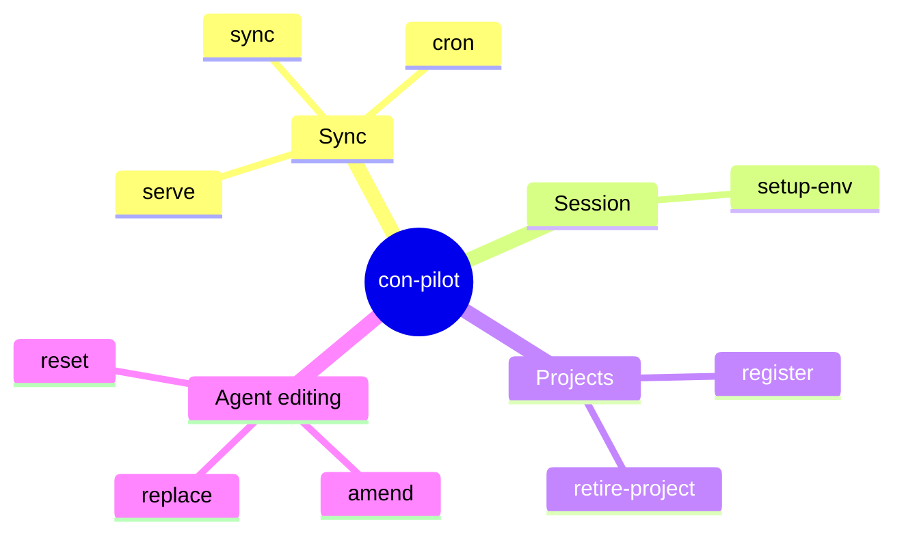
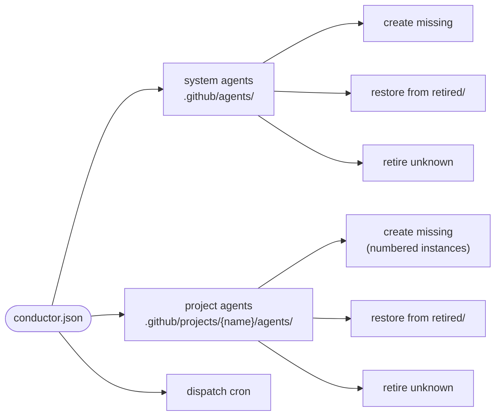
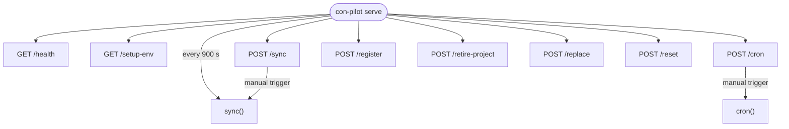
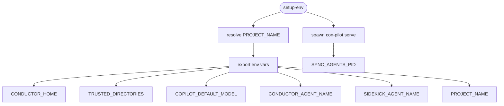
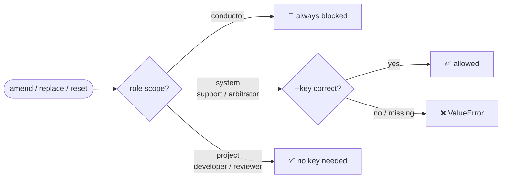
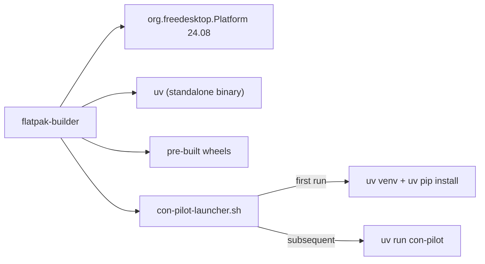

# con-pilot

> The synchronisation engine, CLI, and HTTP API for the [Conductor](../../README.md) AI agent system.

`con-pilot` is a Python 3.14 package that keeps your VS Code Copilot agent roster in sync with `conductor.json`, dispatches scheduled cron tasks, and exposes every lifecycle operation as both a CLI and a FastAPI service.

**Deployed as a Flatpak** (`io.conductor.ConPilot`) with uv-based bootstrap — the first run installs a sandboxed Python environment and all dependencies in under 100 ms.

---

## Installation

### Via setup.sh (recommended)

`con-pilot` is installed automatically by the Conductor `setup.sh` installer:

```bash
./setup-0.1.1.sh install ~/.conductor
```

This installs the Flatpak bundle, which bootstraps Python 3.14 + all dependencies on first run.

### From source (development)

```bash
cd $CONDUCTOR_HOME/python/con-pilot
uv pip install -e ".[dev]"
```

The `con-pilot` entry point is then available at `.venv/bin/con-pilot`.

---

## Quick start

```bash
# Bootstrap your session
eval $(con-pilot setup-env --shell)

# One-shot sync
con-pilot sync

# Run the background watcher (con-pilot serve is also started by setup-env)
con-pilot serve
```

---

## Commands



| Command | Description |
|---------|-------------|
| [`sync`](#sync) | Reconcile `.agent.md` files with `conductor.json` |
| [`cron`](#cron) | Dispatch due cron jobs to `pending.log` |
| [`serve`](#serve) | Run the FastAPI sync service |
| [`setup-env`](#setup-env) | Print session env vars and start the watcher |
| [`register`](#register) | Register a new project |
| [`retire-project`](#retire-project) | Archive a project |
| [`amend`](#amend) | Append/replace the `## Instructions` section in agent file(s) |
| [`replace`](#replace) | Replace the full body of agent file(s) |
| [`reset`](#reset) | Reset agent file(s) to template/default |

---

### sync

```
con-pilot sync
```

Reads `conductor.json`, creates missing agent files, retires removed ones, and dispatches cron jobs. Idempotent — safe to run any number of times.



---

### cron

```
con-pilot cron
```

Checks all agents with `has_cron_jobs: true` and appends any due tasks to `pending.log`. Called automatically at the end of every `sync` cycle.

---

### serve

```
con-pilot serve [-i SECONDS]
```

Starts a FastAPI service with a background sync loop. Default interval: 900 s (15 min).



| Endpoint | Method | Description |
|----------|--------|-------------|
| `/health` | GET | `{"status": "ok"}` |
| `/setup-env` | GET | Resolve project context and return session env vars |
| `/sync` | POST | Trigger a manual sync cycle |
| `/cron` | POST | Trigger a manual cron dispatch |
| `/register` | POST | Register a new project (`name`, `directory`) |
| `/retire-project` | POST | Retire a project (`name`) |
| `/replace` | POST | Replace agent body (`file_content`, `role`, `project`, `key`) |
| `/reset` | POST | Reset agent to defaults (`role`, `project`, `key`) |

---

### setup-env

```
con-pilot setup-env [--shell]
```

Resolves the current project, prints all session environment variables, and spawns `con-pilot serve` as a background daemon.

```bash
# Add to your shell profile or .envrc:
eval $(con-pilot setup-env --shell)
```



Output:

```
CONDUCTOR_HOME=/home/user/.conductor
TRUSTED_DIRECTORIES=/home/user/.conductor:/home/user/projects/my-app
COPILOT_DEFAULT_MODEL=claude-opus-4.6
CONDUCTOR_AGENT_NAME=uppity
SIDEKICK_AGENT_NAME=code-monkey-my-app-agent-1
PROJECT_NAME=my-app
SYNC_AGENTS_PID=48291
```

---

### register

```
con-pilot register <name> <directory>
```

Adds a project to `trust.json`, creates its agent directory scaffold, and runs an initial sync so all agent files are created immediately.

```bash
con-pilot register my-app /home/user/projects/my-app
```

---

### retire-project

```
con-pilot retire-project <name>
```

Moves `.github/projects/{name}/` to `.github/retired-projects/{name}/` and removes the project from `trust.json`. Non-destructive — the directory can be restored manually.

```bash
con-pilot retire-project my-app
```

---

### amend

```
con-pilot amend <file> <role> [project] [--key KEY]
```

Appends or replaces the `## Instructions` section in all matching agent files. Every other section is left untouched. Multi-instance agents (e.g. `developer.1`, `developer.2`) are all amended at once.

```bash
# Project agent — no key needed
con-pilot amend instructions.md developer my-app

# System agent — requires the system key
con-pilot amend instructions.md support --key $(cat $CONDUCTOR_HOME/key)
```

---

### replace

```
con-pilot replace <file> <role> [project] [--key KEY]
```

Replaces the entire body of matching agent files while preserving the YAML frontmatter.

```bash
con-pilot replace new-body.md reviewer my-app
```

---

### reset

```
con-pilot reset <role> [project] [--key KEY]
```

Regenerates matching agent files from their template (`.github/agents/templates/{role}.agent.md`) or from `conductor.json` if no template exists.

```bash
con-pilot reset developer my-app
con-pilot reset support --key $(cat $CONDUCTOR_HOME/key)
```

---

## Security



- **Conductor** (`conductor.agent.md`) is permanently blocked from modification via `amend`, `replace`, or `reset`.
- **System agents** (`scope: system`) require `--key $(cat $CONDUCTOR_HOME/key)`.
- **Project agents** (`scope: project`) require no key.

The system key is a UUID auto-generated on first use and stored at `$CONDUCTOR_HOME/key`.

---

## Development

```bash
# Run the full test suite (89 tests: 56 unit + 33 CLI integration)
python3 -m pytest tests/ -v

# With coverage
python3 -m pytest tests/ -v --cov=con_pilot --cov-report=term-missing

# Lint + format
ruff check src/ && ruff format src/

# Build the Flatpak (from the repo root)
CONDUCTOR_HOME=$(pwd) task build
```

### Flatpak build

The Flatpak bundles con-pilot with a uv-based launcher. On first run it creates a sandboxed venv and installs all wheels from the bundle:



For full architecture documentation, see the [Conductor README](../../README.md).
