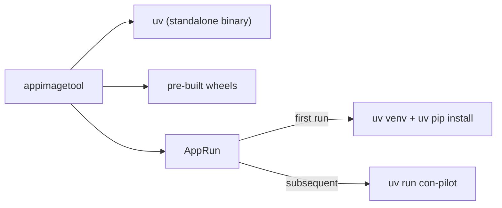

# con-pilot

The Python service and CLI for Conductor agent orchestration.

`con-pilot` is responsible for:
- synchronizing agent files from configuration,
- dispatching cron tasks,
- serving the FastAPI API used by the outer `conduct` tooling,
- starting Copilot SDK-backed conductor runtime at service startup.

## What is current

- Configuration source: `conductor.json` (not `conductor.yaml`)
- Python requirement: `>=3.11`
- Copilot integration package: `github-copilot-sdk`
- API prefix default: `/api/v1` (configurable via `CON_PILOT_API_BASE` and `CON_PILOT_API_VERSION`)

## Installation

### Development

```bash
cd src/python/con-pilot
uv sync --all-groups
source .venv/bin/activate
```

CLI entrypoint:

```bash
con-pilot --help
```

## CLI commands

From [src/python/con-pilot/src/con_pilot/main.py](src/python/con-pilot/src/con_pilot/main.py):

- `con-pilot sync`
- `con-pilot cron`
- `con-pilot serve [-i|--interval SECONDS]`
- `con-pilot setup-env [--shell]`
- `con-pilot register NAME DIR`
- `con-pilot retire-project NAME`
- `con-pilot list-agents [-p|--project PROJECT] [--json]`
- `con-pilot validate [FILE] [--json]`
- `con-pilot replace FILE ROLE [PROJECT] [--key KEY]`
- `con-pilot reset ROLE [PROJECT] [--key KEY]`

Notes:
- `amend` is currently disabled in code.
- `setup-env` prints environment values; the CLI path does not start a background server process.

## API endpoints

All routes are mounted under `/api/v1` by default.

### Health / runtime

- `GET /api/v1/health`
- `GET /api/v1/version`
- `GET /api/v1/startup-proof`

`/startup-proof` returns runtime evidence for Copilot startup state:
- SDK package version visibility
- service wiring status
- whether Copilot client is started
- whether conductor session is started
- startup error message, if any

### Auth / admin

- `POST /api/v1/login`
- `POST /api/v1/verify-key`
- `POST /api/v1/create-user`
- `GET /api/v1/show-me` (dev-only, gated by `CON_PILOT_DEV_SHOW_ME`)

### Agents

- `GET /api/v1/agents`
- `GET /api/v1/agents/{name}`
- `GET /api/v1/agents/config`
- `GET /api/v1/agents/config/{name}`
- `PATCH /api/v1/agents/config/{name}` (requires `X-Admin-Key`)

### Sync / validation

- `POST /api/v1/sync`
- `POST /api/v1/cron`
- `GET /api/v1/validate`
- `POST /api/v1/validate`

### Project operations

- `GET /api/v1/setup-env`
- `POST /api/v1/register`
- `POST /api/v1/retire-project`
- `POST /api/v1/replace`
- `POST /api/v1/reset`

### Config versioning (`/api/v1/config`)

- `GET /api/v1/config`
- `POST /api/v1/config`
- `GET /api/v1/config/{version}`
- `POST /api/v1/config/diff`
- `GET /api/v1/config/{version}/diff-with-active`
- `POST /api/v1/config/{version}/activate` (requires `X-Admin-Key`)
- `PUT /api/v1/config/{version}` (requires `X-Admin-Key`)
- `POST /api/v1/config/{version}/restore` (requires `X-Admin-Key`)
- `DELETE /api/v1/config/{version}` (requires `X-Admin-Key`)

### Snapshot management (`/api/v1/snapshot`)

- `GET /api/v1/snapshot`
- `POST /api/v1/snapshot`
- `GET /api/v1/snapshot/changes`
- `POST /api/v1/snapshot/check-and-create`
- `GET /api/v1/snapshot/watcher`
- `POST /api/v1/snapshot/watcher/start`
- `POST /api/v1/snapshot/watcher/stop`
- `GET /api/v1/snapshot/{filename}`
- `GET /api/v1/snapshot/{filename}/download`
- `DELETE /api/v1/snapshot/{filename}`

## Security model

- System key file: `$CONDUCTOR_HOME/key`
- API admin header: `X-Admin-Key`
- Install key header: `X-Install-Key`

Operational rules:
- `replace` / `reset` disallow editing conductor agent content.
- System-scope agent edits require key authorization.

## Startup behavior

On `con-pilot serve` startup, the app lifecycle:

1. Loads config versions and snapshots.
2. Ensures system agent files exist.
3. Starts `CopilotAgentService`.
4. Attempts to establish conductor Copilot session at startup.
5. Starts periodic sync loop.

Use `GET /api/v1/startup-proof` to verify actual runtime startup state.

## Development checks

```bash
cd src/python/con-pilot

# tests
pytest -q

# lint/format
uv run ruff check src tests
uv run ruff format src tests
```



For full architecture documentation, see the [Conductor README](../../README.md).
